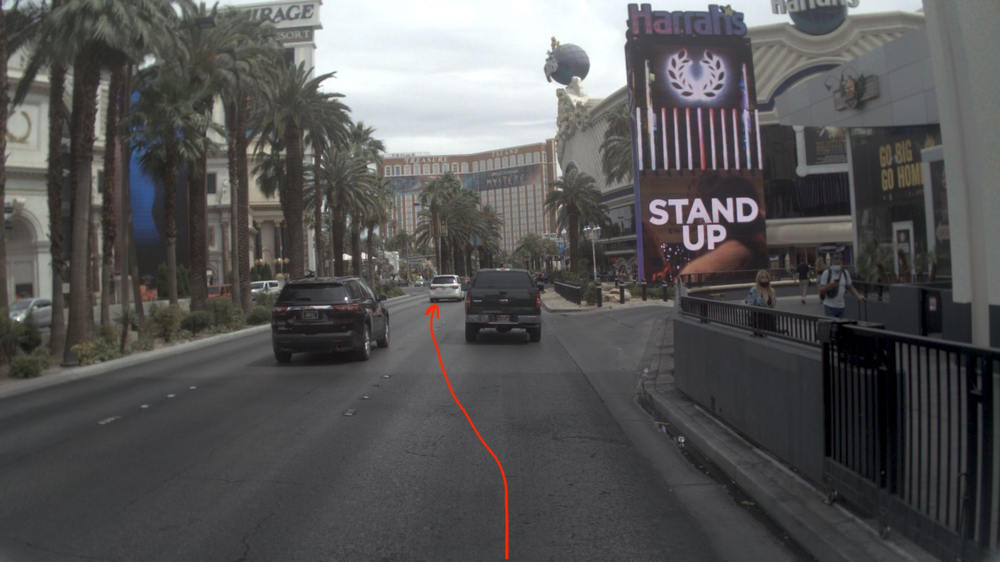
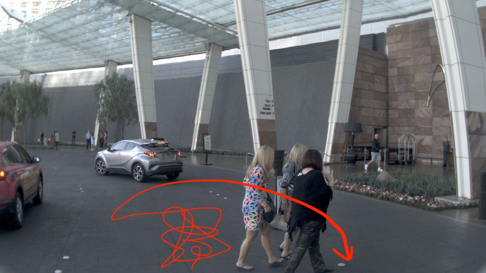
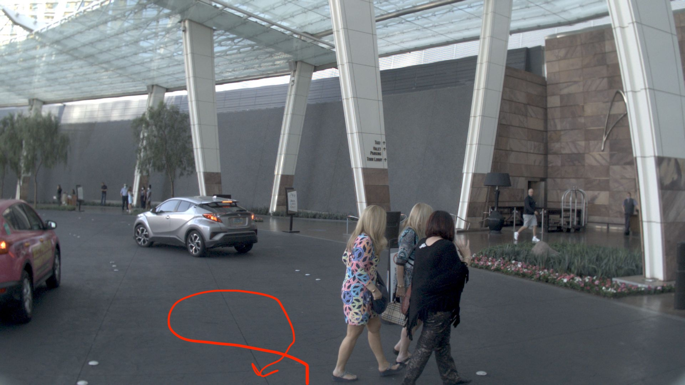
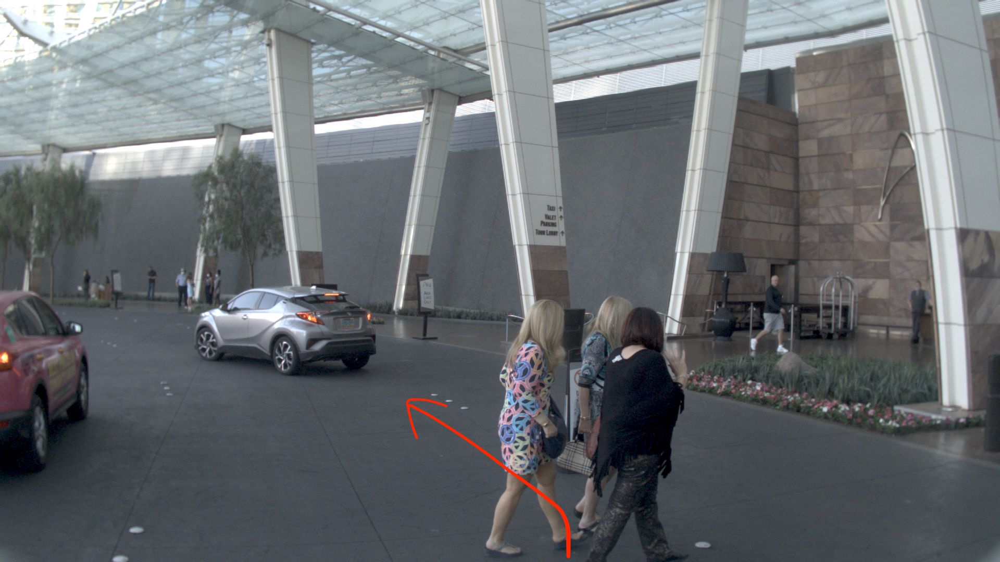
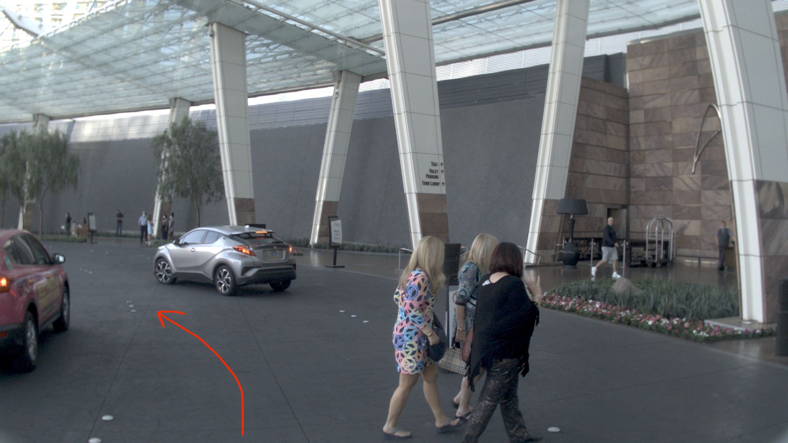

# VLM Trajectory Evaluation (Small Models)

This repo is a lightweight sanity check for how small VLMs handle trajectory-style
queries (e.g., "follow the SUV", "avoid pedestrians") when given a few candidate
trajectories as images. The current notebooks use Qwen3-VL 2B model.

NOTE: This is not a rigorous evaluation and the results are not meant to be conclusive. The goal is to explore how small embedding-based VLMs can be used for trajectory evaluation once the candidate trajectories are avaiable by other means (e.g. https://github.com/valeoai/DrivoR).

## Notebooks

`vl-reranker.ipynb`: Uses [Qwen3-VL 2B Reranker](https://huggingface.co/Qwen/Qwen3-VL-Reranker-2B) model to score candidate trajectories based on a query.

In the example below, the model has 3 trajectories it can take, however, based on the instruction it should prefer the trajectory **following the black SUV**.

<!-- table with 3 images -->
| Trajectory 1 | Trajectory 2 | Trajectory 3 |
| --- | --- | --- |
|  |  |  |
| Score: 0.6786 | Score: 0.6340 | **__Score: 0.6979__** |

The model correctly identifies the preferred trajectory and scores the `Trajectory 3` the highest.

Now, if we instruct the model to turn to the harris (Casino building on the right), it should prefer `Trajectory 1`, which it exactly does by providing the following scores:

| Trajectory 1 | Trajectory 2 | Trajectory 3 |
| --- | --- | --- |
| **__Score: 0.7704__** | Score: 0.7551 | Score: 0.7482 |

However, when asked to follow the **white** SUV, the model fails to identify the correct trajectory and chooses `Trajectory 3`. Interestingly, when replacing the word "SUV" with "car", the model correctly identifies `Trajectory 2`.

Clearly, this 2B model is too small and hence sensitive to the exact wording of the instruction, requiring careful prompting to get the desired behavior.

More examples can be found in the [notebook](./vl-reranker.ipynb).

The format was inspired by this [paper](https://arxiv.org/abs/2211.13227) which also rendered trajectories on images, except that everything was on a single image and fed to a VLM, prompted to choose the safest trajectory.

## Bonus

Model was prompted to avoid pedestrians and it almost correctly picked `Trajectory 3`, but was confused by `Trajectory 4`.
| Trajectory 4 | Trajectory 3 | Trajectory 2 | Trajectory 1 |
| --- | --- | --- | --- |
|  |  |  |  |
| **__Score: 0.6163__** | Score: 0.5920 | Score: 0.5747 | Score: 0.5571 |

It feels like model sees the word "pedestrians" and totally forgets that it should AVOID them.